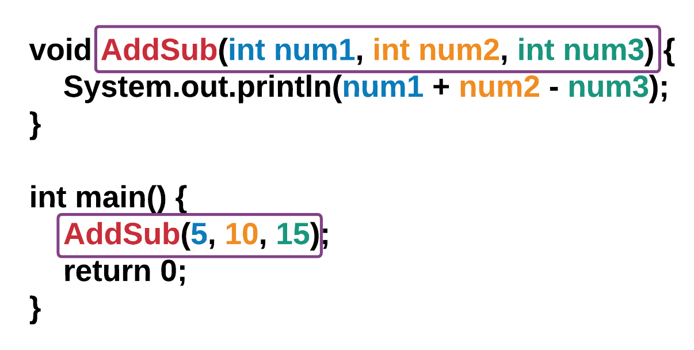
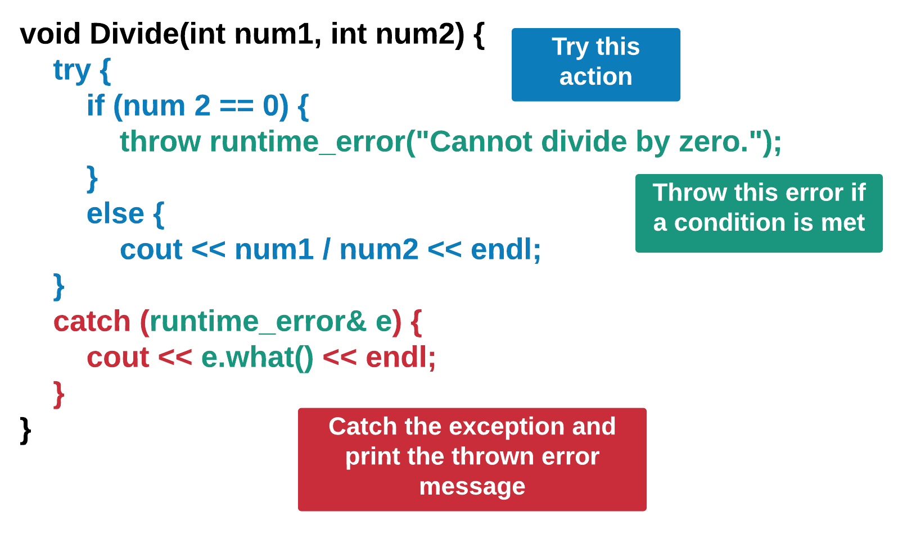

iostream:
A C++ header file that allows input and output operations (e.g., cin, cout).

vector:
A dynamic array from the C++ Standard Template Library (STL) that can grow or shrink in size automatically. 
It stores elements in a contiguous block of memory and provides fast access by index.

namespace:
A way to group names (like functions and variables) to avoid naming conflicts.
std is the standard namespace in C++.

endl:
A special stream manipulator that inserts a newline and flushes the output buffer. used for immediate things i.e. text or healthbar or level.

\n:
A newline character that moves the cursor to the next line. It does not flush the buffer. used for continuous things like loops i.e doing damage 
repeating name and class taking damage and battle start.

**Example of rpg character class**

#include <iostream>
#include <string>

using namespace std;

class RPGCharacter {
private:
    string name;
    string charClass;
    int level;
    int health;

public:
    // Constructor
    RPGCharacter(const string& name, const string& charClass, int level, int health)
        : name(name), charClass(charClass), level(level), health(health) {}

    // Display character info
    void displayInfo() const {
        cout << "Character Info:" << endl;
        cout << "Name: " << name << "\n";
        cout << "Class: " << charClass << "\n";
        cout << "Level: " << level << endl;
        cout << "Health: " << health << endl;
    }

    // Simulate taking damage
    void takeDamage(int damage) {
        cout << name << " takes " << damage << " damage!\n";
        health -= damage;
        if (health < 0) health = 0;
        cout << "Remaining Health: " << health << endl;
    }
};

int main() {
    RPGCharacter hero("Arin", "Warrior", 5, 100);

    hero.displayInfo();
    cout << "\nBattle Begins!\n\n";

    hero.takeDamage(25);
    hero.takeDamage(50);

    return 0;
}

**Printing

file Output

For Linux 

use code runner or ctrl+shift+b = create .exe 

or

to run file in linux terminal run:
g++ filename.cpp -o rainbow

g++ = invokes gnu compiler
filename.cpp = file 
-0 = operator

then type ./rainbow to execute file in terminal
this will print text in terminal

for windows only ctrl+shift+b
then run ./rainbow.exe

for multi-line comments use /*multi example*/
for standard comments use //standard example

cout sends your output to console or terminal whatever is default

**Variables

Declaring = setting or declare the data typetype and name of the variable,
these two properties dont change.

Assigning = when setting the value of the variable, the variablecan change.

Accessing = when you retrieve the value of the variable by calling its name.

octal numbers = start with a 0 so the system converts any number with a Zero
to a decimal number.

**Data Types:Floating point numbers

Floats = are numbers with a decimal they can be positive or negative.

Double = because floats use 4 bytes it is ineffiecient to use, so we use
use double because it uses 8 bytes.

--also int has a whole number.

**Boolean

It is a declared variable that only take a true or false value.

Boolean values are case sensative and must be in all lowercase.

**Boolean Operators

== is equal checking
2= is assigning a value to the variable
2!= checks if values are not equal
!= is not equal to
boolAlpha checks Boolean for true or false
= assigns a value to a variable

**Strings

A collection of text numbers or symbols

i.e. 

#include <iostream>
using namespace std;

int main() {
    string words = "This is a string.";
    cout << words << endl;

    return 0;
}
    must be in lower case

**Declaring a Variable

string my_var, My_var, thisIsAwesome;

1.must start with an underscore or letter.
2.cannot use c++ keyword i.e. class.
3.c++ does not allow duplicate names for variables.
4.c++ does not allow spaces for variables.

**Iniatializing & Assigning

1.you can do this seperately or combine the same statement.
2.since the value stored in a variable can change, we call it assigning or reassigning.
3.cout accessesthe variable.

**Basic data types

1.Double
2.int
3.string
4.bool

**Arithmetic Operators

less than & and less then equal too
cout << boolalpha << (a < b) << endl;
cout << boolalpha << (c <= d) << endl;

the < is used to check if less then another
this is less than or equal to <=

this is greater than >
this is greater or equal than >=

&& Operator

allows for compound or multiple boolean expressions.
all must be true to be true otherwise its false.

|| operator 

allows for compound boolean expression, if atleast one expression is true then the whole thing is true ro be false all have to be false.

! operator

forces oposite result for expression

**Short Circuiting

if c++ can determine the result of a boolean expression before evaluating the entire thing it will stop and return the value.

when using || c++ checks if first boolean is true, if true it will return true and ignore remaining expressions.

when using && it does the same but for false boolean expressions.

**Conditionals

if else syntax

it checks to see if condition is true or false, else handles false case with both having their own curly braces {} no boolean expression for this when condition is false.

if else statement

used when you want something speciffic to happen if boolean is true and something different for false.

you can also have nested if else statements in else statements
else if is best

switch case statement

A way to make a decision with multiple possible outcomes. instead of nesting outcomes or sequencing many if statements.

**For Loops

printed code that repeats multiple time.

turtle syntax graphics

a librairy or package that allows for simple drawing
comands or binary language.

common comands--

bob.forward(n)
bob.backward(n)
bob.right(d)
bob.left(d)

n represents number of pixels

d represnts number of degrees

screen.exitonclick();

prevents screen from closing after code finished running now will only close when user clicks on screen.

turtle requires SFMC Library

**While Loops

its like a for loop but usually contains a boolean expression
the for and while loop produce the same results.

use a while loop in most cases instead of a for loop !!ESPECIALLY FOR VIDEO GAMES!!

however if specific loop parameters are required using a for loop would be better.

**Break Statement

is used to stop the loop at a particular point in the program.
to avoid infinite loops.

**Nested Loops

a loop that exists in another loop.

can be used to create unique and complex outputs

however due to its complex nature its rare to see more than two

this shouldnt be something to aim for because it makes code harder to understandespecially in team enviorments

if possible you should refactor and simplify as much as possible.

**Vectors

**Array

Is a data structure that stores a collection of data such as ints, doubles, strings, etc.

**Array Access

The position n+ which an element is stored is called its index. 
01234 = index always starts at 0 

**Array Modification

to modify an element within an array simply find the index at which that element is stored and assigned a new value to it.

**Array Iteration

if more than a few using a loop would be more beneficial and clean.

**sizeOf

calculates the sizeof the array in bytes in c++. a string takes up 32 bytes each string multiplies it by one so i.e 32 *  10  =  320
                                                byte|string|output
to get exact string size youll have to use 
cout << sizeOf()/sizeOf([0]) << endl;

**Enhanced For Loop

AKA range-based for loop-
can be used to itterate through array elements without having to refer to any array indices.

**Array Algorithms

in addition to being used with loops, arrays can also be used with conditionals to help with tasks such as searching a particular element fining a minimum or maximum element or printing elements in reverse order.

**Vector basics

Arrays are usefule but considered static = cant be changed.
vectors = dynamic you can change these while the program is running

**ADD or Sub Elemets

push_back(20) will add specific element in () to end of vector.
if empty it will only be one element inside vector.

**Mod vector elements

to modify use at() to specify index number and then then assign a new element to it.

Initializing vector element does not require push_back()

iterating 

a vector is similar to using an array but instead of using brackets at()

**Vector Algorithms

same as array algorithms but can reverse order of element not just print them.

**2D Array

an aray in another array is called a 2d array. its a symbolic table where there are rows and columns.
1st pos is ROW
2nd pos is COL

**2D Array syntax

is an array type followed by a name for 2D array by two empty pairs of brackets
[1] [2]
rows, columns

**modifying Array

to mod use var[1][3]

this would be row 1 column 3

**2D Iteration Array

in this case it uses for loops to iterate, outter for rows,
inner loop for columns.

**Pointers

pointer declaration 

a data type that stores a memory address of another piece of data.  
much like how an array points to all of its elements as a collection, pointers point to the memory address of the data that they are associated with.

Pointer reference

can only be assigned a memory address. they cannot be assigned values that are int,double,string etc. a memory address is denoted with the & symbol called the reference operator. they go in front of the variable that the address is associated with.

Pointer deference

every memory address holds a value and that value can be accessed by using deference operator. it is denoted by a * symbol

pointer to pointer

to assign memory address to a new printer must be denoted with two ** symbols

Pointer usage

comes in hand because they help the system save memory.

**Strings

Characters - Strings are made up of characters between quotation marks (previously covered in the “Fundamentals” section).

Length - Each string has a length (total number of characters).

Index - Each character in a string has a position, called an index.

**String Index

Previously in the vectors module, we learned that vectors and arrays have elements that reside in certain positions or indices. A string too has indices that correspond to the position where each of its character resides. Like vector and array indices, string indices also start at 0.

**Mutability

 Unlike vectors and arrays where the characters can be manipulated, string literals are immutable. That means you cannot change the string literal itself. You can, however, manipulate a particular character within the string. youll have to use '' instead of ""

 **Find

 The find() function tells you if a character or a string is present in another string, and if so, at what index it is at. find() returns an integer index if the character or string is present and 18446744073709551615 if not.

What does 18446744073709551615 mean?
18446744073709551615 is the largest integer value possible in C++. When find() is called and 18446744073709551615 is returned, it means the system has searched through all values and cannot locate the specified value. 18446744073709551615 is an unsigned value, but it is equivalent to -1 as a signed value.

my_string.find("he", 4) to search starting at a particular index add a number after the string.

**substr

The substr() function returns a portion of the string. Within parentheses (), provide the index at which you want the string to start followed by a comma followed by the number of characters you want the string to include. Note that if you don’t specify the number of characters, the system will start copying from the start index through to the end of the string. If you don’t specify the start index, then the system will copy the entire string. The substr() function does not modify the original string. Instead, it returns a partial or entire copy of the original string
my_string.substr(4,9)
left number = start include right = number of characters

**Escape Characters 

An escape character is a character that has a different interpretation than what you see in a string. Escape characters always start with a backslash (\). The most common escape character is the newline character (\n) which causes C++ to print on the next line.

Escape Character	Description	Example
\	Prints a backslash	cout << "\\" << endl;
\’	Prints a single quote	cout << "\'" << endl;
\"	Prints a double quote	cout << "\"" << endl;
\t	Prints a tab (spacing)	cout << "Hello\tworld" << endl;

When you use a " to start a string, C++ looks for the next " to end it. To avoid syntax errors, you can use a double quote to start your string, single quotes for the inner quote, and end the string with a double quote.

**find firstof

The find_first_of() function works similarly to how the find() function does. However, the find_first_of() function will search for any matching characters specified. For example, given the string "this is his string", my_string.find_first_of("his") will return 1 because the character h within his appears first at index number 1. Like the find() function, you can optionally specify an index number to direct the system where to start searching.

push_back(char)
➤ Adds a single character to the end of the string.

insert(pos, str)
➤ Inserts a string at a specified index position.

 pop_back()
➤ Removes the last character of the string.

erase(pos, len)
➤ Removes a substring starting at pos for len characters.

replace(pos, len, str)
➤ Replaces len characters starting at pos with str.

 append(str)
➤ Adds a string to the end (same as +=).

 toupper() and tolower()
➤ Convert characters to uppercase or lowercase (used with loops).

**iteration
1. Range-based for loop
Simple and clean syntax for read-only access to each character in a string.

 2. For loop with index
Useful when you need access to the index (e.g., for conditions or position-based logic).

3. Using iterators
 STL-style traversal using iterators; flexible for complex container types.

4. Modifying characters using references
Enables in-place modification of each character in the string.

**string comparison

1. Compare strings using == and !=
Purpose: Check if two strings are equal or not equal.

Use Case: Simple comparisons, case-sensitive.

 == returns true if strings are exactly the same.
 != returns true if strings are different.

 2. Compare strings using .compare()
Purpose: Lexicographical (dictionary-style) comparison.

Return Values:

0 if strings are equal

< 0 if first string is less than second

> 0 if first string is greater than second

.compare() gives more control over sorting and ordering logic.

**functions

void - Determines whether there is a return value or not for the function. If the function has no return value, use void. If the function returns an integer, use int, etc.

GreetTwice - This is an example of a function name. See above for naming conventions.

() - Parentheses are required for all functions. Any parameters that the function takes in will go into the parentheses but they are optional.

Doxygen Tool-

There is an online tool called Doxygen that can help generate C++ code documentation. For more information, you may visit the Doxygen website at this link: Doxygen. However, for the purposes of this module, we will only focus on self-created documentation. In particular, we will be using mostly @param for parameters and @return for return values to document our functions.

**parameters

In C++, passing parameters means giving values (arguments) to a function. There are 3 main ways to do this:

pass by value

a copy of the variable is passed
changes made inside the function do not affect the original

Pass by Reference (&)

Passes the original variable.
Changes inside the function do affect the original.

Pass by Pointer (*)
Passes the address of a variable.

Useful when working with dynamic memory or optional arguments.

| Method            | Syntax         | Affects Original? | Used For                                  |
| ----------------- | -------------- | ----------------- | ----------------------------------------- |
| Pass by Value     | `func(int x)`  | ❌ No              | Simple data, safe from side effects       |
| Pass by Reference | `func(int &x)` | ✅ Yes             | Modify original, efficient for large data |
| Pass by Pointer   | `func(int *x)` | ✅ Yes             | Dynamic memory, optional parameters       |

The image shows a C++ function definition and call for a function named AddSub that takes three integer parameters:

void AddSub(int num1, int num2, int num3) {
    cout << num1 + num2 + num3 << endl;
    cout << num1 - num2 - num3 << endl;
}

💡 Explanation of the Function Call:
cpp
Copy
Edit
AddSub(5, 10, 15);
num1 = 5

num2 = 10

num3 = 15

✅ Output of the Function:
cpp
Copy
Edit
5 + 10 + 15 = 30
5 - 10 - 15 = -20
🧠 Summary:
This example demonstrates:

Order of parameters matters: values are assigned in the same order as defined.

It performs two operations using all three values:

Addition of all three

Subtraction in sequence (num1 - num2 - num3)

Let me know if you'd like to see a version using references, return values, or user input!

**checking parameters

**Variable Scope

Local scope means that a variable is declared inside a function or a block (like inside {} braces) and is only accessible within that function or block. Once the function or block finishes executing, the variable goes out of scope and cannot be accessed.

Global Scope in C++

A variable declared outside all functions (usually at the top of a file) has global scope. It can be accessed (read or modified) from any function in that file (and other files if declared extern). Global variables exist for the entire duration of the program.

Global vs. Local Scope
If a variable is declared and initialized both locally and globally, that variable will retain its content depending on how it is used. In the example below, my_var is declared and initialized globally as global scope and locally as local scope. Since the variable has differing scopes, it retains its value when called or printed.

**returning values

Returning Values in C++
1. Use the return Keyword to Return a Value
In C++, functions can return values using the return keyword.

int add(int a, int b) {
    return a + b;  // returns the sum of a and b
}
2. Return Value of print Statements (std::cout)
The std::cout object is an instance of ostream. When you use:

std::cout << "Hello";
It returns the ostream object itself, which allows chaining:

std::cout << "Hello" << " World\n";
So the return value of the print statement (operator<<) is the same ostream object to allow chaining, not the text printed.

3. Return Different Data Types
Functions can return any type:

int getInt() {
    return 42;
}

double getDouble() {
    return 3.14;
}

std::string getString() {
    return "Hello, C++!";
}

bool isEven(int num) {
    return num % 2 == 0;
}
4. Create and Apply Helper Functions
Helper functions are small functions that perform specific tasks and can be used inside other functions.

#include <iostream>
using namespace std;

// Helper function to add two numbers
int add(int a, int b) {
    return a + b;
}

// Helper function to check if a number is even
bool isEven(int n) {
    return n % 2 == 0;
}

// Helper function to greet user by name
string greet(string name) {
    return "Hello, " + name + "!";
}

int main() {
    int sum = add(10, 15);
    cout << "Sum: " << sum << endl;

    bool evenCheck = isEven(sum);
    cout << "Is sum even? " << (evenCheck ? "Yes" : "No") << endl;

    string message = greet("Alice");
    cout << message << endl;

    return 0;
}
Summary:
Concept	Example Code
Return a value	return a + b;
cout returns ostream	Enables chaining: cout << "Hi";
Return different types	int, double, string, bool
Use helper functions	Small reusable functions like add(), isEven()

Return keyword
A statement used inside a function to send a value back to the part of the program that called the function.

Return value
The actual data (value) that a function sends back to its caller when it finishes running.

Function
A reusable block of code that performs a specific task and can optionally return a value.

Helper function
A small, focused function designed to perform a specific sub-task to help the main functions keep code clean and organized.

Data types
The kind of data a function can return, such as int (integer), double (decimal number), string (text), or bool (true/false).

std::cout
The C++ object used to print output to the console; it returns a stream object allowing multiple print statements to be chained together.

